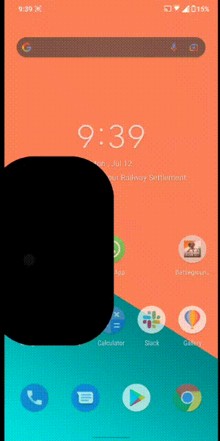
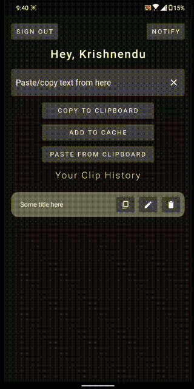
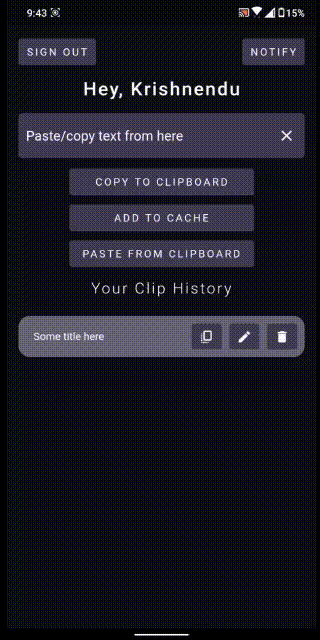
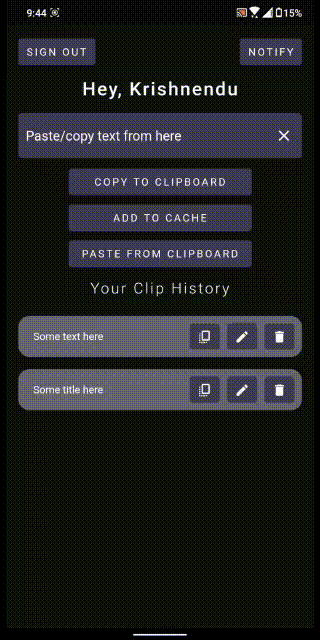

# ClipIo-App

This is the flutter application for the original web-app [ClipIo](https://github.com/berakrishnendu36/ClipIo) with some added features.

  

### Sign in instantly with your google account

  

### Easily enter your text

  

### Save your text for future use

  

### Edit your text with live markdown editor

  

### Copy/Paste and easily transmit your data to other logges in devices

<h2><a href="https://github.com/berakrishnendu36/ClipIo">Check out the other repo for the web app on how to send data to other devices.</a></h2>

## Don't forget to drop a ⭐ if you like it!

